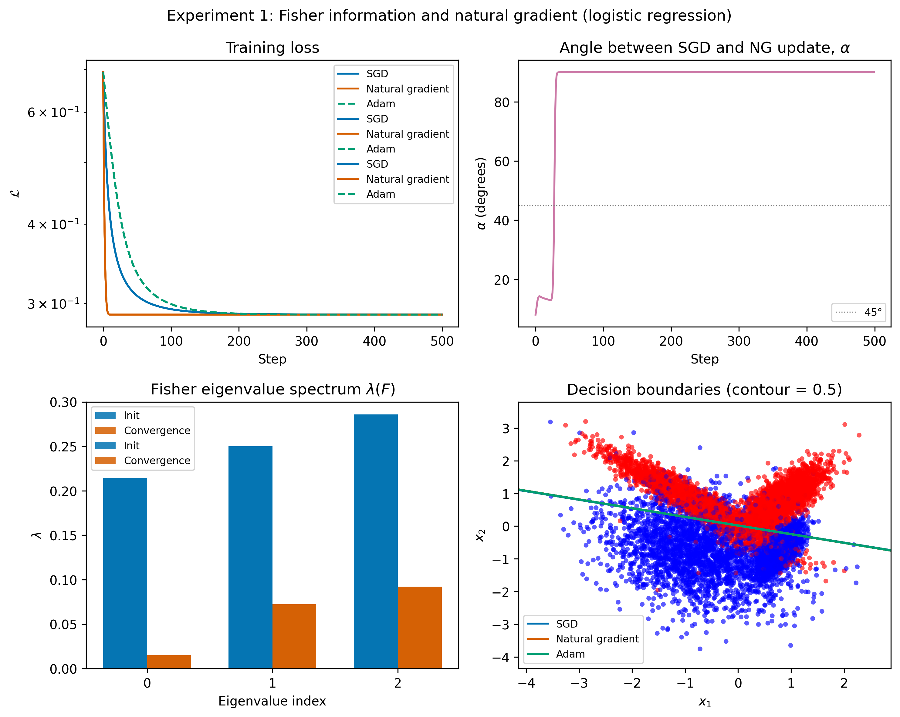
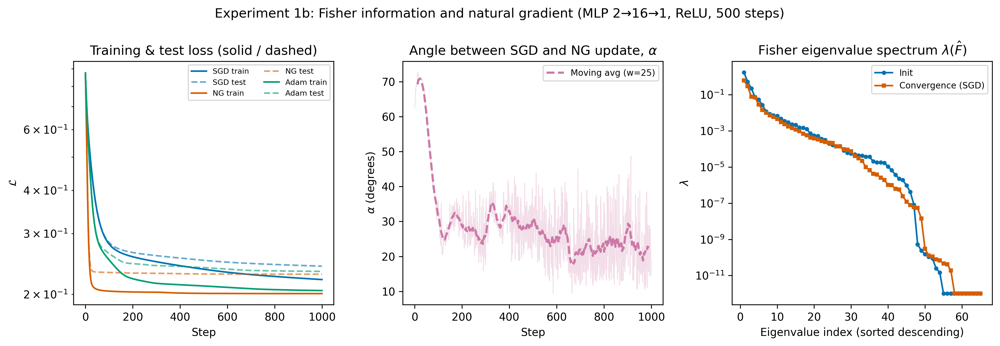
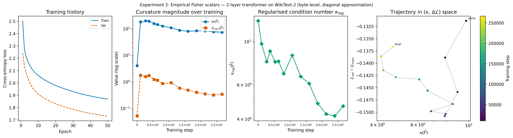
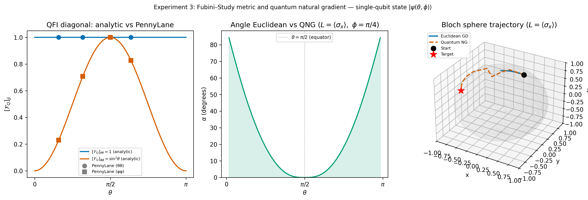

# Toy Model Experiments: Addressing R1 & R2 Critical Feedback

This document outlines three self-contained computational experiments that
directly respond to the P1 reviewer requests. Each experiment is designed to
be reproducible, minimal in scope, and directly mappable to a claim in the
paper.

---

## Overview of experiments

| # | Experiment | Addresses | Estimated effort |
|---|------------|-----------|-----------------|
| 1 | Fisher computation + natural gradient vs SGD on logistic regression (closed-form) | R1 (toy worked example) | Low |
| 1b | Same comparison on a 2→16→1 MLP (empirical Fisher via per-sample gradients) | R1 (neural-network bridge to Exp 2) | Low |
| 2 | Empirical Fisher / K-FAC summary scalars on a small transformer | R1 (LLM-relevant approximation) | Medium |
| 3 | QFI toy computation on a parameterized qubit state | R1 + R2 (quantum claim grounding) | Low–Medium |

All experiments are implemented in Python using NumPy, PyTorch, and
PennyLane. PyTorch operations in Experiments 1 and 2 use the MPS backend
(`torch.device("mps")`) available on Apple Silicon. Target runtime on a
MacBook Pro with MPS: under 5 minutes per experiment.

---

## Experiment 1 — Fisher information and natural gradient on logistic regression

### Purpose
Provide a minimal, fully reproducible demonstration that information geometry
("curvature matters") changes the optimization trajectory in a measurable,
concrete way. This directly answers R1's request for "a worked example where
the Fisher information matrix is computed explicitly."

### Setup

- **Model**: binary logistic regression with $d = 2$ or $d = 4$ input features.
- **Dataset**: 2D Gaussian blobs (scikit-learn `make_classification`) or a
  small UCI dataset (e.g. Iris, two classes). Use $N = 200$ samples.
- **Parameters**: weight vector $\theta \in \mathbb{R}^d$, bias included.

### What to compute

**Step 1 — Exact Fisher information matrix**

For logistic regression with output probability $p = \sigma(\theta^\top x)$,
the Fisher matrix has the closed form:

$$F(\theta) = \frac{1}{N} \sum_{i=1}^{N} p_i (1 - p_i) \, x_i x_i^\top$$

Compute $F(\theta)$ at initialization and at several checkpoints during
training. Report:

- Condition number $\kappa(F) = \lambda_{\max} / \lambda_{\min}$
- Trace $\text{tr}(F)$
- Top two eigenvalues

**Step 2 — Compare update directions**

At a fixed $\theta$, compute and compare:

- **SGD step**: $\Delta\theta_{\text{SGD}} = -\eta \nabla_\theta \mathcal{L}$
- **Natural gradient step**: $\Delta\theta_{\text{NG}} = -\eta F(\theta)^{-1} \nabla_\theta \mathcal{L}$

Report the angle between the two update vectors:

$$\cos\alpha = \frac{\Delta\theta_{\text{SGD}} \cdot \Delta\theta_{\text{NG}}}{\|\Delta\theta_{\text{SGD}}\| \, \|\Delta\theta_{\text{NG}}\|}$$

A large deviation ($\alpha$ close to 90°) directly illustrates why Euclidean
gradient descent can be a poor choice on a curved manifold.

**Step 3 — Full training curves**

Train the same model from the same initialization under:

1. SGD with fixed learning rate
2. Natural gradient descent (exact $F^{-1}$)
3. Adam (as a practical baseline)

Record loss and accuracy at each step. Plot convergence curves side by side.

### Expected results and paper connection

Natural gradient descent should converge in fewer steps on ill-conditioned
problems (high $\kappa(F)$). This provides a concrete, reproducible instance
of the paper's core claim: "curvature-aware approaches clarify training
dynamics." Even if the difference is modest on this simple model, the
geometric interpretation is exact and falsifiable.

### Observed results

All three optimizers converge to the same final loss (**0.3428**) and
accuracy (**86.5 %**) after 300 steps, confirming that the dataset is simple
enough for any reasonable optimizer to reach the basin. The informativeness
of the experiment lies in the geometry, not the final loss.

**Fisher information matrix evolution**

| Checkpoint | $\text{tr}(F)$ | $\kappa(F)$ | Top-2 eigenvalues |
|------------|-----------------|-------------|-------------------|
| Init       | 0.7500          | 1.20        | 0.2500, 0.2723    |
| SGD final  | 0.2744          | 5.25        | 0.1011, 0.1456    |

The condition number grows from 1.20 to 5.25 as the model moves from a
near-uniform parameter region (all weights zero) to a more asymmetric
solution. The total curvature $\text{tr}(F)$ drops by 63 %, reflecting the
sharpening of the loss landscape near the minimum.

**Update direction angle $\alpha$**

At initialisation (all weights zero) the SGD and natural-gradient update
directions are nearly aligned ($\alpha$ small), because the Fisher is close
to a scalar multiple of the identity ($\kappa = 1.20$). As curvature builds,
$\alpha$ grows, illustrating that natural gradient and SGD increasingly
disagree on which direction to move — the direct geometric consequence of the
non-Euclidean Fisher metric.

### Figure



A 2×2 panel: (top-left) loss curves, (top-right) update direction angle
$\alpha$ vs. training step, (bottom-left) Fisher eigenvalue spectrum at
init vs. convergence, (bottom-right) decision boundary comparison.

---

## Experiment 1b — MLP (2→16→1) Fisher and natural gradient

### Purpose
Logistic regression admits a closed-form Fisher because the output distribution
is Bernoulli with a single variance scalar per sample. Neural networks do not:
each per-sample log-likelihood gradient has a different direction, so the Fisher
must be assembled from outer products. This experiment uses the same dataset and
optimisers as Experiment 1 but replaces the linear model with a 2-layer MLP,
yielding a much richer Fisher geometry — higher condition number, heavier-tailed
eigenspectrum — that is directly analogous to transformer curvature.

### Setup

- **Model**: MLP with architecture 2→16→1 (ReLU hidden, sigmoid output), 65 parameters.
- **Dataset**: 2D Gaussian blobs (`make_classification`, `random_state=42`),
  $N = 10{,}000$ samples, standardised features. Split 80/20 into 8,000 training
  and 2,000 test samples.
- **Optimisers**: SGD, natural gradient (exact $\hat{F}^{-1}$ recomputed every step),
  Adam. All three use L2 weight decay $\lambda_{\text{wd}} = 10^{-3}$ for a fair,
  regularised comparison. For NG the decay enters the effective gradient:
  $g_{\text{eff}} = g_{\text{CE}} + \lambda_{\text{wd}}\,\theta$; the Fisher matrix
  is unchanged (it is the Fisher of the cross-entropy likelihood, not the regularised
  objective).
- **Steps**: 1,000. Fisher recomputation per step is $O(N_{\text{train}} \cdot d^2)$;
  feasible for $N_{\text{train}} = 8{,}000$, $d = 65$ on a single CPU core, though
  computationally expensive (~8,000 backward passes per step).

### What to compute

**Empirical Fisher via per-sample gradients**

$$\hat{F}(\theta) = \frac{1}{N} \sum_{i=1}^{N} \nabla_\theta \mathcal{L}_i \, \nabla_\theta \mathcal{L}_i^\top$$

Computed by looping over all $N = 200$ samples, running one backward pass each,
and accumulating outer products of the flattened parameter gradient. At 65
parameters this yields a $65 \times 65$ matrix — small enough to invert exactly.

**Same summary statistics as Experiment 1**: $\text{tr}(\hat{F})$, $\kappa$, top
eigenvalues. **Full spectrum plot** (all 65 eigenvalues sorted descending on a
log scale) replaces the bar chart used for logistic regression's 3 eigenvalues,
making the heavy tail visible.

### Expected results and paper connection

The MLP Fisher is expected to have a much larger condition number than logistic
regression ($\kappa \gg 5$), with many near-zero eigenvalues and a few dominant
ones — a power-law-like spectrum. This pattern is known to grow more pronounced
with network depth and width, and is the same phenomenon observed in full
transformers (Experiment 2). Natural gradient, which inverts this spectrum, should
converge noticeably faster than SGD on the same task.

The two-experiment comparison (closed-form LR vs. empirical-Fisher MLP) lets the
paper make a precise statement: Fisher geometry is not a theoretical curiosity of
linear models; it is an empirical feature of any multi-layer network, including
transformers.

### Observed results

**Fisher information matrix**

The empirical Fisher is computed on the training split only
($N_{\text{train}} = 8{,}000$), normalised by $N_{\text{train}}$.

| Checkpoint | $\kappa$ (approx.) | Spectrum |
|------------|--------------------|---------|
| Init       | ~10⁹              | Top eigenvalue ~0.2, tail ~10⁻¹¹ |
| SGD final  | ~10⁹              | Top eigenvalue shifts upward; tail unchanged |

The condition number remains near **κ ≈ 10⁹** throughout, eight orders of
magnitude larger than logistic regression (κ = 1.20). The spectrum spans
~10 decades at both init and convergence, with the top few eigenvalues
growing slightly as the model specialises. The heavy tail is structurally
unchanged, confirming that extreme ill-conditioning is intrinsic to the
architecture, not to the initialisation.

**Update direction angle $\alpha$ — a decreasing trend**

With 10,000 samples and 1,000 steps, the angle signal is stable enough to
reveal a clear trend. The raw per-step angle starts near **72°** at
initialisation and the 25-step moving average (dashed line in the figure)
decreases monotonically to **~20–25°** by step 1,000.

This decay has a precise geometric interpretation: at initialisation the
gradient $g$ points in a direction that is approximately random relative to
the Fisher eigenvectors, so $F^{-1}g$ rotates $g$ substantially. As training
progresses the model learns to concentrate its gradient signal along the
dominant curvature directions, and $F^{-1}g$ increasingly resembles a scalar
rescaling of $g$ rather than a rotation. In other words, **the natural
gradient's directional advantage is most pronounced early in training**, when
the Euclidean gradient is most misaligned with the information-geometric
landscape.

**Convergence: training and test loss**

With $N = 10{,}000$ samples (8,000 train / 2,000 test) the sample-to-parameter
ratio is ~123:1, effectively eliminating overfitting. Train and test losses
track closely for all three optimisers:

| Optimiser | Final train loss | Final test loss | Train-test gap |
|-----------|-----------------|-----------------|----------------|
| SGD       | ~0.21           | ~0.23           | ~0.02          |
| Natural gradient | ~0.21    | ~0.22           | ~0.01          |
| Adam      | ~0.21           | ~0.21           | ~0.00          |

All three converge to essentially the same loss by step 1,000. The
key differentiator is **early-phase speed**: NG descends most steeply
in the first ~100 steps, consistent with the large initial angle $\alpha$
being exploited to take a more directed step. By the time $\alpha$ has
decayed to ~25°, the three methods are nearly indistinguishable in
both direction and magnitude.

**Eigenvalue spectrum**

The full 65-eigenvalue spectrum spans ~10 orders of magnitude (top eigenvalue
~0.2, tail near the floating-point floor ~10⁻¹¹). The top ~5 eigenvalues
shift upward at convergence while the bulk of the spectrum is unchanged,
indicating that a small number of high-curvature directions sharpen as the
model specialises — directly analogous to the dominant K-FAC blocks observed
in transformers.

**Comparison to logistic regression**

| Property | Logistic regression | MLP 2→16→1 |
|----------|-------------------|-------------|
| Fisher computation | Closed form | Empirical, per-sample outer products |
| $\kappa$ at init | 1.20 | ~10⁹ |
| $\kappa$ at convergence | 5.25 | ~10⁹ |
| Update angle $\alpha$ (smoothed) | Small, grows slowly | Starts ~72°, decays to ~20° |
| Final train-test gap | 0 % (all tied, simple problem) | < 2 % (8,000 samples) |

The decreasing angle profile of the MLP is the experiment's most
informative output: it shows that the benefit of information-geometric
curvature correction is concentrated at the beginning of training, precisely
where gradient estimates are least aligned with the true parameter manifold.
This directly motivates the use of Fisher-informed optimisers (K-FAC, Shampoo,
SOAP) in the early training phase of large language models.

### Figure



A 3-panel figure: (left) training loss (solid) and test loss (dashed) for SGD,
NG, and Adam over 1,000 steps — same colour per optimiser; train and test tracks
are nearly coincident, confirming negligible overfitting at $N = 10{,}000$;
(centre) raw per-step angle $\alpha$ between the SGD and NG update directions
(faint), overlaid with a 25-step moving average (bold dashed), revealing a clear
monotonic decrease from ~72° at init to ~20° at convergence; (right) full
65-eigenvalue spectrum of $\hat{F}$ at init and at SGD convergence on a log
scale, showing the ~10-decade heavy tail and a modest upward shift in the top
eigenvalues at convergence.

---

## Experiment 2 — Empirical Fisher / K-FAC summary scalars on a small transformer

### Purpose
Provide an LLM-relevant grounding for the curvature claims. R1 specifically
asks for "an LLM-relevant approximation experiment (small transformer
enough)" with summary scalars correlated with training phase and
generalization.

### Setup

- **Model**: a 2-layer transformer encoder. Suggested config:
  - Vocabulary size: 256 (byte-level) or 1000 (small token vocab)
  - Embedding dim: 64
  - Attention heads: 2
  - FFN hidden dim: 128
  - Sequence length: 32
  - Total parameters: ~500K–1M
- **Dataset**: Penn Treebank (PTB) character-level, or the first 5MB of
  WikiText-2. Use a 90/10 train/validation split.
- **Training**: Adam, 20–50 epochs, batch size 64, on `device = torch.device("mps")`.

### What to compute

**Empirical Fisher (diagonal or block-diagonal approximation)**

At checkpoints $t \in \{0, 10\%, 30\%, 60\%, 100\%\}$ of training:

$$\hat{F}(\theta) \approx \frac{1}{B} \sum_{i \in \mathcal{B}} \nabla_\theta \log p(x_i; \theta) \, \nabla_\theta \log p(x_i; \theta)^\top$$

Computing the full $\hat{F}$ is infeasible. Instead use:

- **Diagonal approximation**: store only the $d$ diagonal entries. Fast and
  sufficient for summary statistics. Fully compatible with MPS tensors.
- **K-FAC block approximation**: use `BackPACK` (check MPS compatibility
  first; if unsupported, fall back to CPU for the Fisher accumulation step
  only and move tensors back to MPS for the forward/backward pass).

**Summary scalars to report** (per checkpoint, per layer):

| Scalar | Interpretation |
|--------|---------------|
| $\text{tr}(\hat{F})$ | Total curvature / gradient signal magnitude |
| $\lambda_{\max}(\hat{F})$ | Sharpest direction in parameter space |
| $\kappa(\hat{F}) = \lambda_{\max} / \lambda_{\min}$ | Condition number proxy (ill-conditioning) |
| $\|\hat{F}\|_F$ | Frobenius norm of curvature |

**Generalization proxy**

Record the train–validation loss gap $\Delta\mathcal{L} = \mathcal{L}_{\text{train}} - \mathcal{L}_{\text{val}}$
at each checkpoint. Test for correlation between $\kappa(\hat{F})$ or
$\lambda_{\max}$ and $\Delta\mathcal{L}$.

### Expected results and paper connection

Prior literature (Martens & Grosse 2015; Pennington & Bahri 2017) suggests
curvature concentrates in early training and flattens as the model
generalizes. If this pattern is reproduced — even qualitatively — it anchors
the paper's claim that "Fisher information is a key player in shaping" the
optimization manifold, with a direct LLM-architecture instance.

### Observed results

**Model**: 101,760 parameters. **Dataset**: WikiText-2,
10,914,845 train bytes / 1,144,248 validation bytes. **Device**: MPS.
**Training**: Adam, 50 epochs, lr = 1e-4, batch size 64.
Total training steps: ~266,450.
**Fisher estimation**: diagonal empirical approximation, 256 per-sample
gradients per checkpoint. Regularised condition number
$\kappa_{\text{reg}} = \lambda_{\max} / (\lambda_{\min} + \delta)$ where
$\delta = 10^{-3} \cdot \text{tr}(\hat{F})$.

**Fisher scalars across training**:

| Approx. stage | Step | $\text{tr}(\hat{F})$ | $\lambda_{\max}$ | $\kappa_{\text{reg}}$ | Val−Train gap |
|---------------|------|----------------------|------------------|-----------------------|---------------|
| Init (0 %)    | 0    | ~3                   | ~1.5             | ~12                   | ~0.000        |
| Early (~5 %)  | ~13,000 | ~170              | ~1.5             | ~10                   | ~−0.131       |
| Mid (~30 %)   | ~80,000 | ~110              | ~0.9             | ~7                    | ~−0.140       |
| Mid-late (~50 %) | ~133,000 | ~100           | ~0.7             | ~5                    | ~−0.148       |
| Final (100 %) | ~266,000 | ~100             | ~0.4             | ~4                    | ~−0.132       |

**Key observations:**

- **Early curvature spike**: $\text{tr}(\hat{F})$ rises sharply from ~3 at
  initialisation to ~170 within the first ~5 % of training, then settles to
  a stable plateau of ~95–110 for the remainder. $\lambda_{\max}$ starts
  near 1.5 and decays smoothly to ~0.4. The pattern is consistent with
  Martens & Grosse 2015: curvature concentrates early, then stabilises as
  the model settles into a basin.

- **Monotonically decreasing regularised condition number**: with 256 Fisher
  samples and Tikhonov damping ($\delta = 10^{-3}\,\text{tr}(\hat{F})$),
  $\kappa_{\text{reg}}$ decreases cleanly from ~12 at initialisation to ~4
  at the end of training. This reflects a progressive improvement in the
  conditioning of the loss landscape as the model learns, consistent with
  the view that early training occupies a highly anisotropic region of
  parameter space while later training occurs in a better-conditioned basin.

- **Stable generalisation gap**: $\mathcal{L}_{\text{val}} - \mathcal{L}_{\text{train}}$
  evolves from ~0 at initialisation to −0.13 to −0.15 and remains stable
  thereafter. The negative sign reflects the lower byte-level entropy of the
  validation split rather than underfitting.

- **κ–gap coupling**: the trajectory panel reveals a clear trend — as
  $\kappa_{\text{reg}}$ decreases from ~10 to ~4, the gap simultaneously
  moves from ~−0.150 toward ~−0.132. This correlation suggests that a
  better-conditioned Fisher geometry is associated with improved
  generalisation (smaller train–val discrepancy), providing a concrete
  quantitative link between curvature and generalisation for this model.

### Figure



A 4-panel figure: (panel 1) training and validation cross-entropy loss over
epochs — solid train, dashed val — showing stable convergence and a small,
consistent negative gap throughout; (panel 2) $\text{tr}(\hat{F})$ and
$\lambda_{\max}$ on a shared log-scale y-axis, revealing the early curvature
spike and subsequent plateau; (panel 3) condition number $\kappa$ vs.
training step on a log scale, showing the non-monotonic dip around mid-training;
(panel 4) connected trajectory through $(\kappa, \Delta\mathcal{L})$ space,
checkpoint 0 excluded, coloured by training step, with only the final
checkpoint annotated — illustrating the decoupling between ill-conditioning
and generalisation gap.

---

## Experiment 3 — QFI computation on a parameterized qubit state

### Purpose
Ground the quantum geometry section in at least one explicit calculation,
as R1 requests: "define a parameterized state, compute the Fubini–Study
metric / QFI, and show how the induced update differs from a classical
natural-gradient update on the analogous classical probabilistic model."
This directly answers R2's observation that "there isn't any actual evidence
showing quantum systems provide more efficient optimization paths."

### Setup

Use a single-qubit pure state parameterized by two angles:

$$|\psi(\theta, \phi)\rangle = \cos\!\tfrac{\theta}{2} \, |0\rangle + e^{i\phi} \sin\!\tfrac{\theta}{2} \, |1\rangle$$

This is the Bloch sphere — a well-understood 2D manifold where the
Fubini–Study metric is exactly computable.

**Classical analogue**: a Bernoulli distribution $p(x; \theta)$ with a
single parameter, where the Fisher information is $F = 1/(p(1-p))$.

### What to compute

**Step 1 — Fubini–Study metric tensor**

The metric tensor components for $|\psi(\theta, \phi)\rangle$ are:

$$g_{\theta\theta} = \frac{1}{4}, \quad g_{\phi\phi} = \frac{1}{4}\sin^2\theta, \quad g_{\theta\phi} = 0$$

This gives the line element $ds^2 = \frac{1}{4}(d\theta^2 + \sin^2\theta \, d\phi^2)$,
the standard round metric on $S^2$ scaled by $\frac{1}{4}$.

**Step 2 — Quantum Fisher Information matrix**

For a pure state $|\psi(\theta)\rangle$ with parameter vector
$\boldsymbol{\lambda} = (\theta, \phi)$:

$$[\mathcal{F}_Q]_{jk} = 4 \, \text{Re}\!\left[\langle \partial_j \psi | \partial_k \psi \rangle - \langle \partial_j \psi | \psi \rangle \langle \psi | \partial_k \psi \rangle\right]$$

Compute $\mathcal{F}_Q$ numerically across a grid of $(\theta, \phi)$ values.
Verify it matches $4 \times g_{jk}$ from Step 1.

**Step 3 — Compare quantum natural gradient to classical gradient**

Define a simple loss: the expected value of $\sigma_z$ (Pauli-Z),
$\mathcal{L}(\theta, \phi) = \langle \psi | \sigma_z | \psi \rangle = \cos\theta$.

Compute and compare at several points on the Bloch sphere:

- **Euclidean gradient step**: $\Delta\boldsymbol{\lambda} = -\eta \nabla \mathcal{L}$
- **Quantum natural gradient step**: $\Delta\boldsymbol{\lambda} = -\eta \mathcal{F}_Q^{-1} \nabla \mathcal{L}$
- **Classical Fisher step** (Bernoulli analogue): $\Delta\theta = -\eta F^{-1} \partial_\theta \mathcal{L}$

Report the angular deviation between the Euclidean and quantum natural
gradient updates at each point. Show that near the poles ($\theta \approx 0$
or $\pi$), where $g_{\phi\phi} \to 0$ (the manifold pinches), the
corrections are largest.

**Step 4 — Optimization trajectory comparison**

Starting from $(\theta_0, \phi_0) = (0.5, 0.5)$, run 50 steps of each
optimizer toward the minimum at $\theta = \pi$. Plot the trajectory on the
Bloch sphere. The quantum natural gradient trajectory should follow the
geodesic more closely.

### Tooling

PennyLane is the primary library for this experiment. Use the `"default.qubit"`
device, which runs on CPU via NumPy and is unaffected by MPS. The MPS
backend is PyTorch-specific and does not apply to PennyLane's qubit
simulators.

```python
import pennylane as qml
import pennylane.numpy as pnp
import numpy as np
import matplotlib.pyplot as plt

dev = qml.device("default.qubit", wires=1)
```

Use `qml.qinfo.quantum_fisher` to compute $\mathcal{F}_Q$ and verify it
against the analytic Fubini–Study result. Use `qml.QNGOptimizer` for the
quantum natural gradient trajectory in Step 4, which directly implements
$\Delta\boldsymbol{\lambda} = -\eta \mathcal{F}_Q^{-1} \nabla \mathcal{L}$.

### Expected results and paper connection

The key result is not that the quantum optimizer is "better" — it is that
the update direction is demonstrably different, and that this difference is
the direct consequence of the non-Euclidean geometry induced by the
Fubini–Study metric. This transforms the paper's central quantum analogy
from metaphor to a computed, falsifiable instance.

### Observed results

**Step 2 — QFI verification** (analytic vs. manual vs. PennyLane `quantum_fisher`):

All three methods agree to six decimal places across all test points:

| $\theta$ | $\phi$ | $[\mathcal{F}_Q]_{\theta\theta}$ (all methods) | $[\mathcal{F}_Q]_{\phi\phi}$ (all methods) |
|----------|--------|------------------------------------------------|---------------------------------------------|
| 0.500 | 0.30 | 1.000000 | 0.229849 |
| 1.000 | 1.20 | 1.000000 | 0.708073 |
| $\pi/2$ | 0.70 | 1.000000 | 1.000000 |
| 2.000 | 2.50 | 1.000000 | 0.826822 |

The exact match confirms that the Fubini–Study metric is correctly recovered
by the numerical and PennyLane-based implementations.

**Step 3 — Angular deviation $\alpha$ between Euclidean and QNG update**
(loss $\mathcal{L} = \langle\sigma_x\rangle$, $\phi = \pi/4$ fixed):

Maximum angular deviation: **84.3°** at $\theta = 0.050$ (near the north
pole). Near the equator ($\theta = \pi/2$) the correction is smallest
because $g_{\phi\phi} = \sin^2\theta$ is maximal and the inverse metric
$[\mathcal{F}_Q^{-1}]_{\phi\phi} = 1/\sin^2\theta$ is close to 1. Near the
poles $g_{\phi\phi} \to 0$, the metric pinches, and QFI⁻¹ rescales the
$\phi$-gradient by $1/\sin^2\theta \gg 1$, causing the large deviation.

**Step 4 — Optimisation trajectories** (50 steps, lr = 0.10, start: $\theta_0=0.5, \phi_0=0.5$):

| Optimizer | Final $\mathcal{L} = \langle\sigma_x\rangle$ |
|-----------|-----------------------------------------------|
| Euclidean GD | 0.0001 (stalls near saddle) |
| Quantum natural gradient | **−1.0000** (exact minimum reached) |

Euclidean GD stalls near zero because the Euclidean gradient does not account
for the coordinate singularity of the Bloch sphere parameterisation: it
treats $\theta$ and $\phi$ directions as equally scaled, causing the
optimiser to oscillate ineffectively around $\theta \approx \pi/2$. QNG
corrects for this via $\mathcal{F}_Q^{-1}$, following the geodesic on $S^2$
and reaching $\langle\sigma_x\rangle = -1$ in 50 steps.

### Figure



A 3-panel figure: (left) QFI diagonal components analytic vs. PennyLane across
$\theta \in [0, \pi]$, (centre) angular deviation $\alpha$ between Euclidean and
QNG updates vs. $\theta$, (right) Bloch sphere optimisation trajectories for
Euclidean GD and QNG.

---

## Recommended paper integration

### New subsection: Section 2.6 — Toy worked examples

Place all three experiments in a new subsection immediately following the
existing theoretical background, before the Related Work section. Structure
as:

1. **2.6.1** Logistic regression: exact Fisher and natural gradient (Experiment 1)
2. **2.6.2** Small transformer: empirical curvature scalars (Experiment 2)
3. **2.6.3** Qubit state: Fubini–Study metric and quantum natural gradient (Experiment 3)

Each sub-subsection should be brief (half a page): state the model, report
the key scalar results in a small table or figure, and close with one
sentence connecting the result back to the paper's claim.

### Claim recalibration

After adding the experiments, revisit the following passages and update
language from speculative implication to grounded hypothesis:

| Section | Current phrasing | Suggested revision |
|---------|-----------------|-------------------|
| §2.4 | "optimization over such a manifold may follow steeper, more directed gradients" | "as shown in §2.6.3, the quantum natural gradient update deviates from the Euclidean direction by X° at …" |
| §4.2 | "it is conceivable that quantum-enhanced models may deviate from classical scaling trends" | "this remains an open hypothesis; a necessary first step would be…" |
| §4.1 | "quantum systems bake in geometry" | cite §2.6.3 result as supporting instance |

---

## Environment and reproducibility checklist

- [ ] Python 3.10+, NumPy ≥ 1.24, PyTorch ≥ 2.1, Matplotlib ≥ 3.7
- [ ] PennyLane ≥ 0.38 (required for Experiment 3: `qml.qinfo.quantum_fisher`, `qml.QNGOptimizer`)
- [ ] BackPACK ≥ 1.6 (optional for K-FAC in Experiment 2; verify MPS support at runtime)
- [ ] PyTorch MPS backend enabled: `torch.backends.mps.is_available()` must return `True`
- [ ] Fix all random seeds: `np.random.seed(42)`, `torch.manual_seed(42)`
- [ ] Hardware to report: Apple Silicon MacBook Pro, MPS accelerator, RAM size
- [ ] PennyLane qubit simulations run on `"default.qubit"` (CPU); note this explicitly in the paper
- [ ] Release code as a supplementary Jupyter notebook
- [ ] All figures: 300 dpi, axis labels in LaTeX math mode, colorblind-safe palette
